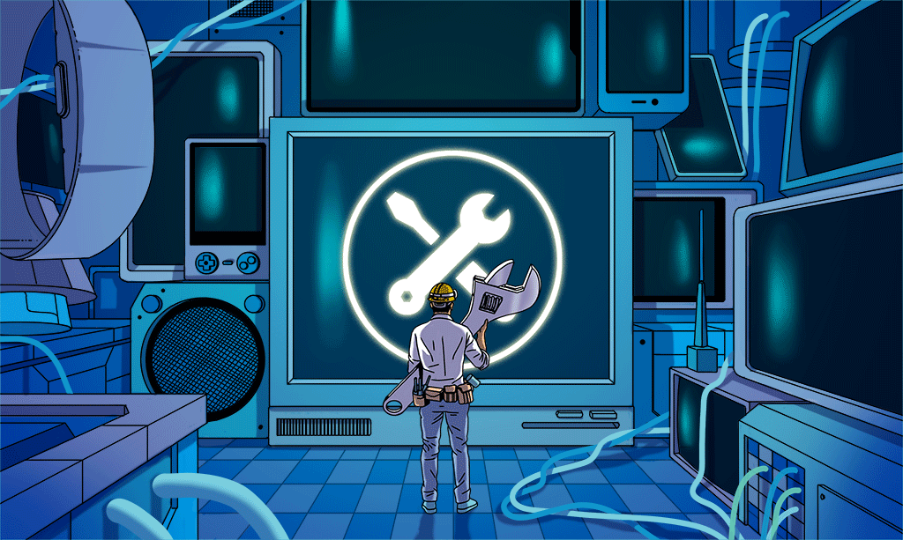

### Hi! there,  I'm Daniel Ogunlolu.

### Github stats

### GitHub activity graph📉:

### Here are random jokes to brighten up your day:smile:

### Website 
<a href="https://www.aceembedded.io">                                                                               
                   
</a>&nbsp;&nbsp;   

   
### Reach me via

&nbsp;&nbsp;

&nbsp;&nbsp;

